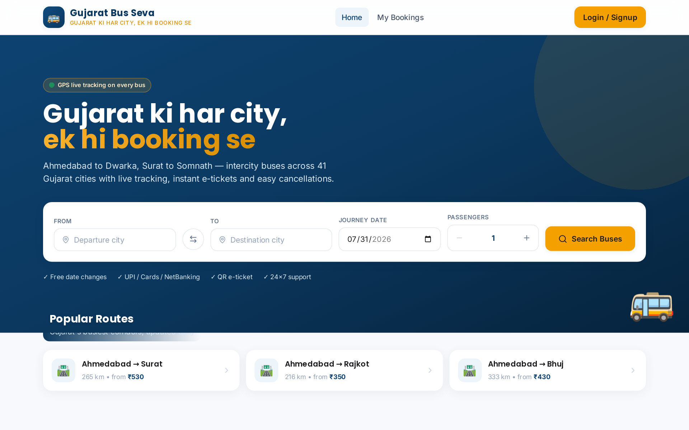
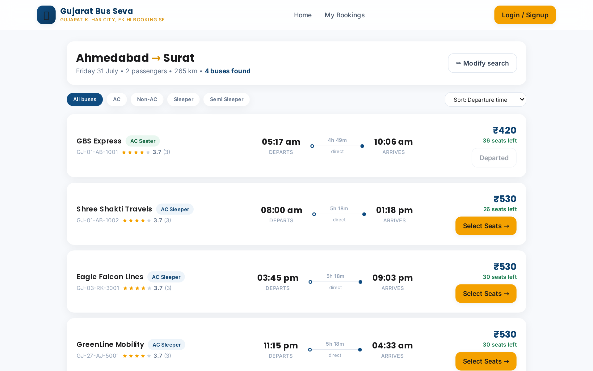
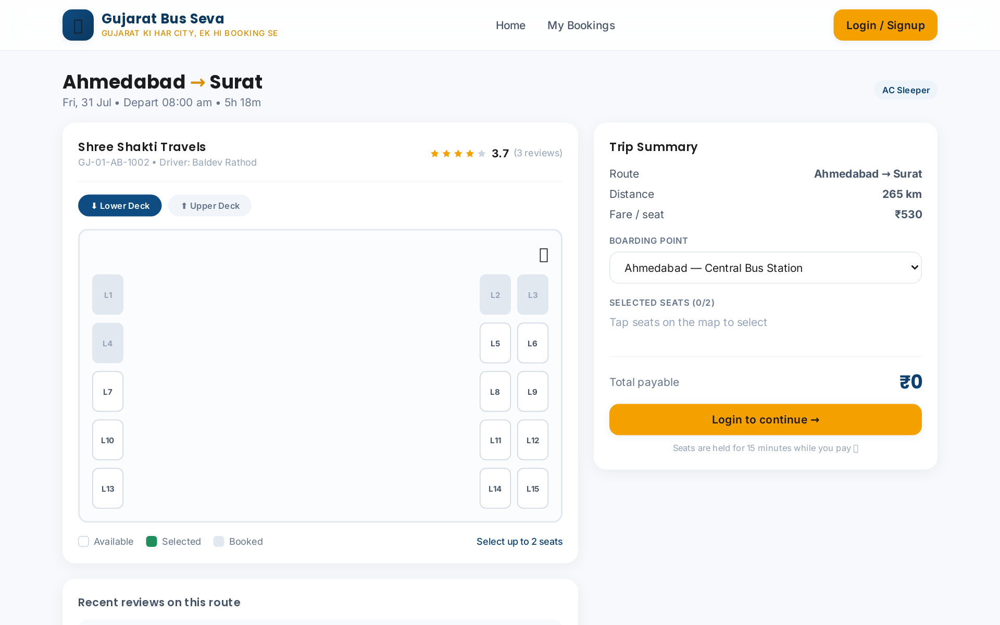
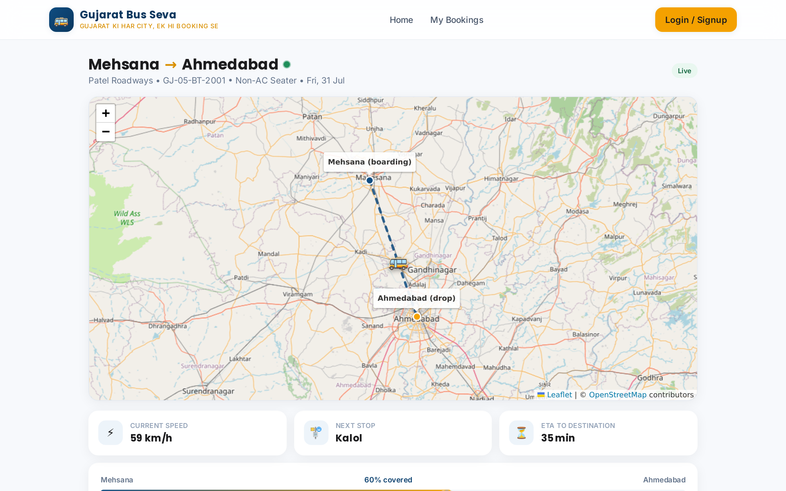
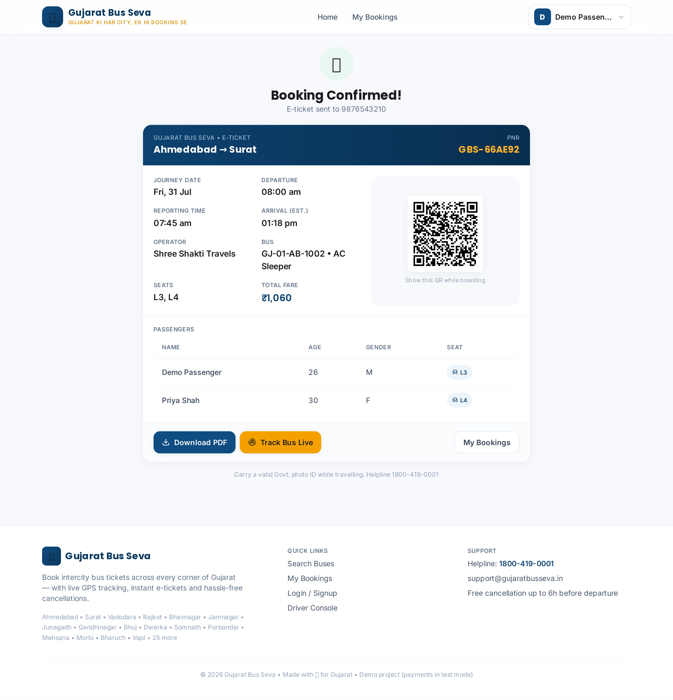
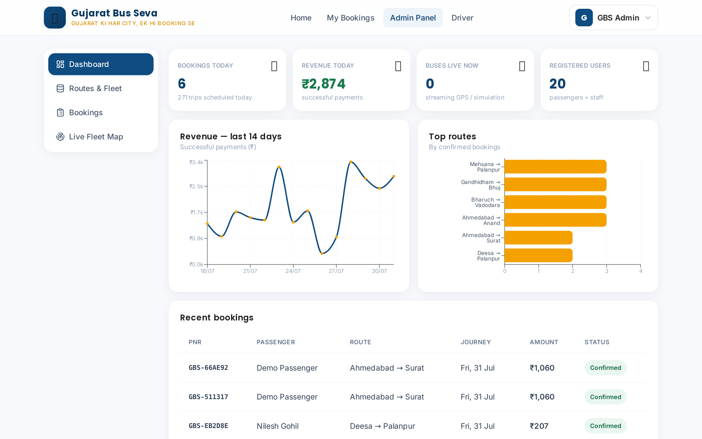
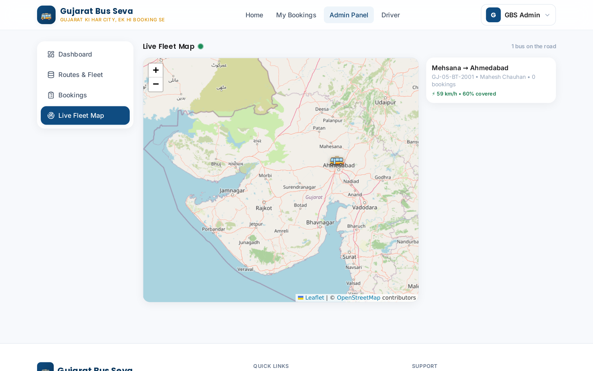
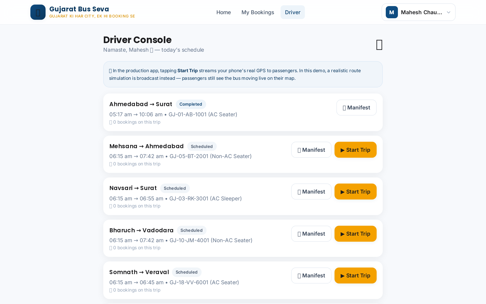

# 🚌 Gujarat Bus Seva

**"Gujarat ki har city, ek hi booking se"** — a full-stack online bus ticket booking platform
with live GPS bus tracking, covering **41 cities of Gujarat**.

Built like a GrandBus-style international booking platform: passenger site + admin panel +
driver console, REST + WebSocket backend, Render-ready deployment.

---

## 📸 Screenshots (real app, real data)

| Home + Search | Search Results |
|---|---|
|  |  |

| Seat Selection | 🗺️ Live Bus Tracking |
|---|---|
|  |  |

| E-Ticket (QR) | Admin Dashboard |
|---|---|
|  |  |

| Live Fleet Map | Driver Console |
|---|---|
|  |  |

---

## ✨ What's inside

| Module | Features |
|---|---|
| **Passenger site** | City autocomplete search (all 41 Gujarat cities), bus listing with filters & sorting, visual seat map (2+2 seater / 2+1 sleeper decks), OTP login, passenger details form, Razorpay payments (demo mode without keys), QR e-ticket + PDF download, My Bookings with cancel/reschedule & reviews, **live bus tracking on a map** |
| **Admin panel** (`/admin`) | Dashboard (bookings, revenue chart, top routes, live counts), route/bus/driver/trip CRUD, bookings report with **CSV export**, **live fleet map** of all buses |
| **Driver console** (`/driver`) | Today's schedule, **Start/Complete trip** (begins live broadcast), passenger boarding manifest with PNRs |
| **Realtime** | Socket.IO rooms `trip:<id>` + `fleet`, location every 4s — simulation engine for demo (real GPS hook ready: `POST /api/driver/:id/location`) |
| **Backend** | Express + Prisma + PostgreSQL (SQLite locally), JWT + OTP auth, PDFKit tickets, QRCode, Razorpay |
| **Frontend** | React 18 + Vite + Tailwind + Framer Motion + Zustand, Leaflet + OpenStreetMap, Recharts, skeleton loaders, fully responsive |

### 🎨 Design system
Deep Gujarat Blue `#0F4C81` • Kesari Gold `#F4A100` • Emerald `#1E8E5A` • Soft Red `#D64545`
Poppins (headings) + Inter (body) • rounded-2xl cards • soft shadows • micro-animations

---

## 🚀 Run locally (2 terminals)

**Prerequisites:** Node 18+. No PostgreSQL needed locally (auto-uses SQLite).

```bash
# Terminal 1 — backend
cd server
npm install
npm run setup:local        # creates SQLite schema + dev.db (Prisma)
node prisma/seed.js        # 41 cities, routes, buses, trips, demo data
npm run dev                # API on http://localhost:4000
npm run smoke              # (optional) 13-point end-to-end API test ✅
```

```bash
# Terminal 2 — frontend
cd client
npm install
npm run dev                # App on http://localhost:5173 (proxies /api + websockets)
```

Open **http://localhost:5173** 🎉

### 🔑 Demo accounts (OTP appears on-screen in dev mode)
| Role | Mobile |
|---|---|
| Passenger | `9876543210` |
| Admin | `9000000001` |
| Driver | `9000000002` |

### 🗺️ See live tracking in 30 seconds
1. Login as **Driver** (`9000000002`) → Driver Console → **Start Trip** on any trip.
2. In another tab, open `/track/<tripId>` (book that trip as passenger, or click a "● Live" badge) — the bus marker moves in real time with speed, ETA & next stop.
3. Login as **Admin** → *Live Fleet Map* shows all moving buses at once.

---

## ☁️ Deploy to Render (one click)

1. Push this folder to a GitHub repo.
2. Render Dashboard → **New → Blueprint** → pick the repo.
   `render.yaml` creates everything: **PostgreSQL DB + API web service (runs migrations + seed automatically) + frontend static site.** URLs auto-wire via `fromService` — no manual env setup needed.
3. Wait for the first deploy (~5–8 min) and open your frontend URL 🎉
4. Optional: add `RAZORPAY_KEY_ID` / `RAZORPAY_KEY_SECRET` (leave empty = demo payments).

> 💡 Render free web services sleep after 15 min idle — for always-on live tracking in production, use a paid instance. WebSockets work on all plans.

---

## 🔧 Going live for real

| Piece | Change |
|---|---|
| **Payments** | Add Razorpay test/live keys → payment confirmation verifies HMAC signature server-side |
| **SMS OTP** | Plug Twilio/Firebase in `server/src/routes/auth.js` (`devOtp` disappears in production) |
| **Driver GPS** | Driver app calls `POST /api/driver/:id/location {lat,lng,speed}` every 5–10s — already broadcast-ready |
| **Email/SMS tickets** | Hook SendGrid/MSG91 in the booking confirm handler |

## 📁 Structure

```
gujarat-bus-seva/
├── render.yaml              # Render blueprint (DB + API + static site)
├── server/                  # Express + Prisma + Socket.IO
│   ├── prisma/schema.prisma # PostgreSQL schema (10 models)
│   ├── prisma/seed.js       # 41 cities, 96 routes, 10 buses, ~1000 trips
│   └── src/
│       ├── routes/          # auth, cities, trips, bookings, payments, reviews, admin, driver
│       ├── lib/tracking.js  # live-tracking simulation engine
│       └── lib/ticket.js    # QR + PDF e-ticket
└── client/                  # React + Vite + Tailwind
    └── src/pages/           # Home, Results, Seats, Checkout, Ticket, MyBookings,
                             # Track, Driver console, Admin (Dashboard/Data/Bookings/Fleet)
```

## 🔌 Key API endpoints

```
POST /api/auth/otp/request|verify      OTP login (JWT)
GET  /api/cities                       41 Gujarat cities (autocomplete)
GET  /api/trips/search                 from/to/date/pax → trips + seat counts
GET  /api/trips/:id                    seat map + booked seats + live location + reviews
POST /api/bookings                     create booking (15-min seat hold) + payment order
POST /api/payments/confirm             verify Razorpay signature / demo confirm
GET  /api/bookings/:pnr/ticket.pdf     QR e-ticket PDF
GET  /api/admin/stats|bookings.csv     dashboard + reports
POST /api/driver/:id/start|complete    go live → Socket.IO room trip_<id>
```

---

Made with 💙 for Gujarat. Demo project — payments & OTP run in safe test modes by default.
